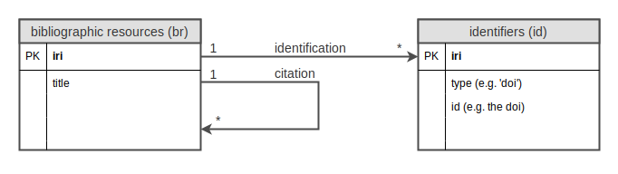

Overview
--------

Downloads and processes citation data from [OpenCitations](http://opencitations.net/).

Pre-requisites
--------------
* Python 2 or 3
* [DAR](http://dar.linux.free.fr/)

Setup
-----

`pip install -r requirements.txt`

Configure
---------

Optionally create `.config` file with the following content:

```bash
TEMP_DIR=<some other temp directory>
```

By default it will use `.temp`.

Download and Extract
--------------------

To download and extract:

`./download_and_extract_from_occ_corpus.sh`

Alternatively use one of the other bash scripts to run an individual step (see below).

* `download_and_extract_from_occ_corpus.sh`
  * `download_occ_corpus.sh`
    * Download _identifiers (id)_ and _bibliographic resources (br)_ zip files from [OpenCitations](http://opencitations.net/download)
  * `extract_from_occ_corpus_zip.sh`
    * `extract_json_from_occ_corpus_zip.sh`
      * `extract_occ_corpus_zip.sh`
        * Unzips DAR files from downloaded zip files
      * `extract_occ_corpus_dar.sh`
        * Extracts JSON files from DAR files
    * `extract_from_occ_corpus_json.sh`
      * Extracts _id_ to _doi_ mapping, as `id-doi-map.csv`
      * Extracts _br_ to _id_ links (`br-id-links.csv`) and _br_ to _citation_ links (`br-citation-links.csv`)
      * Replaces the _br_id_ in `br-citation-links.csv` with _doi_, using `br-id-links.csv` and `id-doi-map.csv`

The final output will be `doi-citation-links.csv` with the columns:
* _citing_doi_
* _citing_title_
* _cited_doi_

(~1 GB, 100 MB compressed)

OpenCitations Data
------------------

The following diagram illustrates the data used from the [OpenCitations Corpus](http://opencitations.net/download).



